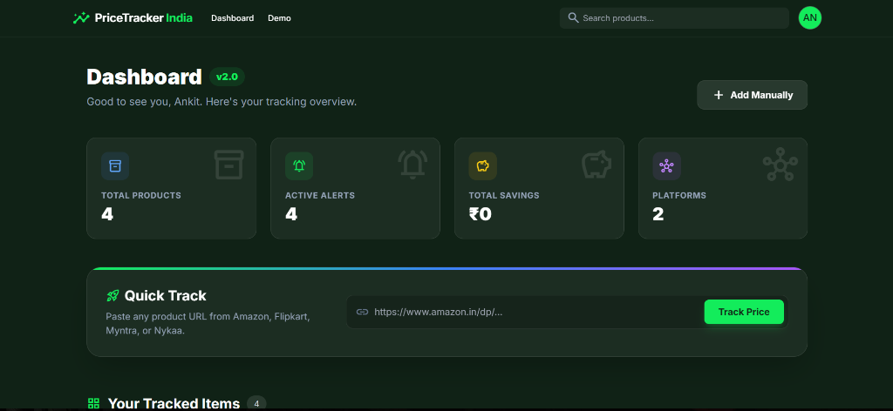
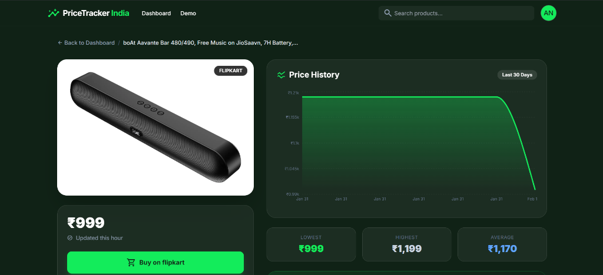

# ⚡ Smart Price Tracker - E-commerce Price Tracker


[](https://opensource.org/licenses/MIT)
[](https://nodejs.org)
[](https://reactjs.org)
[](https://www.mongodb.com/)

> **Stop overpaying.** Track prices from Amazon, Flipkart, Myntra, and more. Get instant alerts when prices drop. 📉💸

## ✨ Key Features

*   **🕵️‍♂️ Multi-Platform Tracking:** Supports Amazon, Flipkart, Myntra, Nykaa, Snapdeal, and more.
*   **📉 Real-time Price History:** Crypto-style glowing area charts to visualize price trends over time.
*   **🔔 Instant Alerts:** Get email notifications the second a product hits your target price.
*   **💎 Premium Glass UI:** Modern, responsive dark-mode interface with glassmorphism effects.
*   **📊 Smart Analysis:** Automatically calculates Lowest, Highest, and Average prices.
*   **📱 Mobile Ready:** Fully responsive design that looks great on any device.

## 🚀 Tech Stack

*   **Frontend:** React (Vite), Tailwind CSS, Recharts, Framer Motion
*   **Backend:** Node.js, Express.js
*   **Database:** MongoDB Atlas
*   **Scraping:** Puppeteer & Cheerio (High-performance hybrid scraping)
*   **Notifications:** Nodemailer

## 🛠️ Installation & Setup

1.  **Clone the repo**
    ```bash
    git clone https://github.com/yourusername/price-pulse.git
    cd price-pulse
    ```

2.  **Install Dependencies**
    ```bash
    # Install server dependencies
    cd server
    npm install

    # Install client dependencies
    cd ../client
    npm install
    ```

3.  **Environment Variables**
    Create a `.env` file in the `server` folder:
    ```env
    PORT=5000
    MONGO_URI=your_mongodb_connection_string
    JWT_SECRET=your_secret_key
    EMAIL_USER=your_email@gmail.com
    EMAIL_PASS=your_app_password
    FRONTEND_URL=http://localhost:5173
    ```

4.  **Run Locally**
    ```bash
    # Terminal 1: Backend
    cd server
    npm run dev

    # Terminal 2: Frontend
    cd client
    npm run dev
    ```

## 📸 Screenshots

| Dashboard | Product Details |
|-----------|-----------------|
|  |  |

## 🤝 Contributing

Contributions are welcome! Please fork the repo and submit a PR.

## 📄 License

This project is licensed under the MIT License.

---
Made with ❤️ by [Ankit raj](https://github.com/Ankittt-14)
